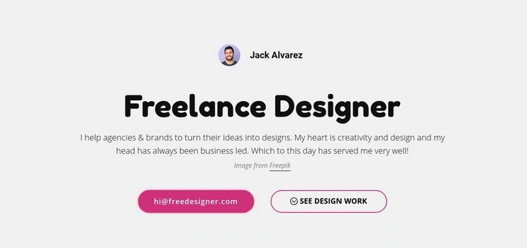

# Be Practical - Freelance Profile Component

## Welcome! 👋

Thanks for checking out this front-end coding challenge.

[Be Practical](https://bepractical.tech/FrontendChallenges) challenges help you improve your coding skills by building realistic projects.

**To do this challenge, you need a basic understanding of HTML and CSS.**

## The challenge

Your challenge is to build out this `freelance-profile-component` and get it looking as close to the design as possible.

## Where to find everything

Your task is to build out the project to the designs inside the `/design` folder. You will find a desktop version of the design. 

The design is in PNG static format. Using PNGs will mean that you'll need to use your best judgment for styles such as `font-size`, `padding` and `margin`. 

You will find all the required assets in the `./style_guide.md` file such as color palette , fonts and image links . The assets are already optimized.

## Building your project

Feel free to use any workflow that you feel comfortable with. Below is a suggested process, but do not feel like you need to follow these steps:

1. You need to visit the challenge page of this challenge .
2. You need to download the starter files , it will be downloaded in zip format , after downloading extract that zip .
3. Then open challenge folder , go into design folder to see the design and view the `style_guide.md` to have a look on colors , fonts and images used in this challenge.
4. Now visit challenge page back and click on `Write Your Code` button .
5. You will see a playground to write HTML , CSS , JS .
6. Write your code , while using `img` tag in your code kindly use the given image link in `style_guide.md` .
7. Click on `Submit` button to submit your code .
7. You will get notified of your result through popup .
8. After successful submission , click on `Get My Certificate` button .
9. Enter your name , and you will get a certificate of completion on behalf of Be Practical .

